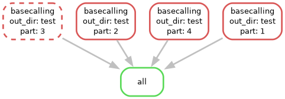
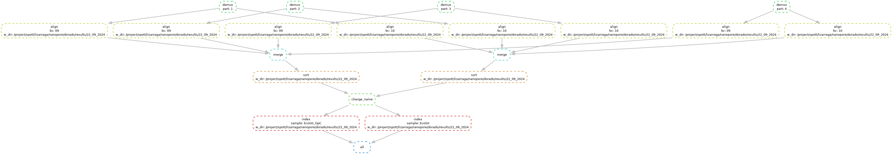

## Overview

This workflow is intended for processing of raw Nanopore sequencing data
(pod5) using `Dorado`, ensuring that both, base calling and modified
bases are inferred, producing as final product aligned bam files per
samples.

It requires two main pipelines, given the different type of nodes used
for each. `Basecalling` uses a GPU node, all the steps downstream of
`basecalling` are run in a CPU node in a single pipeline,
`pre-processing`.

### Steps:

1.  **Basecalling**: Given an input directory with the raw pod5 files,
    runs basecalling for canonical base pairs and also 5mC and 6mA
    modifications.

2.  **Demultiplexing**: For each basecalled bam, demultiplex, based on
    the kit used.

3.  **Alignment**: Basecalled bams for each barcode is aligned, sorted
    and indexed, and renamed to the sample name associated to the
    barcode.

4.  **Merge and sort**: All the aligned bams for a given sample are
    merged and sorted.

5.  **6mA filtering and nucleosomes tag** addition: The merged bam is
    filtered for 6mA and nucleosome tags are added using
    `ft add-nucleosomes`. This last step is required for FIRE.

## Running pipelines

The pipeline is located in
`/project/spott/dveracruz/Dorado_nanopore/workflow`.

For a given run, we need the following parameters:

-   **Output directory**: Full path of the folder where to store the
    results (it will be created if not existant)

-   **Input directory**: Full path that contains the sub folders with
    pod5 raw files.

-   **Kit name**: Name of the kit used, necessary for correct
    demultiplexing.

-   **barcodes**: Barcodes used, currently it accepts 1 barcode -&gt; 1
    sample.

-   **sample\_names**: Samples names to use, same length as barcodes.

This pipeline is based on snakemake.

### Conda enviroments

This pipeline includes calls to the conda environment `fiber_sq`, mostly
for 2 key programs:

-   `samtools=1.19.2`

-   `snakemake=7.32.4`

The environment `pacbio` is used for modkit and `ft` tools.

A copy of the list of packages in these environments are in
**workflow/conda\_env**

### Dorado

Dorado version is dorado=0.4.3

For the models for basecalling & modification detection, the following
are used:

-   model\_base: <a href="mailto:dna_r10.4.1_e8.2_400bps_sup@v4.2.0"
    class="email"><strong>dna_r10.4.1_e8.2_400bps_sup@v4.2.0</strong></a>

-   model\_6mA: <a href="mailto:dna_r10.4.1_e8.2_400bps_sup@v4.2.0"
    class="email"><strong>dna_r10.4.1_e8.2_400bps_sup@v4.2.0</strong></a>**\_<6mA@v2>**

-   model\_5mC: <a href="mailto:dna_r10.4.1_e8.2_400bps_sup@v4.2.0"
    class="email"><strong>dna_r10.4.1_e8.2_400bps_sup@v4.2.0</strong></a>**\_<5mC@v2>**

### Config file

A file like the following is needed to run the data. Including the input
and output directories, the kit name, barcodes and sample names.

A copy is at `workflow/run_samples.yaml` used for the test example.

    ## Config file for Dorado analysis

    in_dir: '/project/spott/dveracruz/Dorado_nanopore/test/raw'
    out_dir: '/project/spott/dveracruz/Dorado_nanopore/test'

    kit_name: "SQK-NBD114-24"
    ## Barcodes to demultiplex: 01 to 24.
    ## Barcodes used per sample, and sample names. as python lists, ['01','02','03'...,'24']
    barcodes: ['09','10']
    sample_names: ['EcoGII_GpC','EcoGII']
    #barcodes: ['09']
    #sample_names: ['EcoGII_GpC']

    ## FIXED PARAMETERS - DO NOT CHANGE UNLESS NEW DORADO VERSION OR MODELS
    dorado_exec: '/project/spott/lizarraga/nanopore/dorado/dorado-0.4.3-linux-x64/bin/dorado'

    ## Dorado models. 
    dorado_models_dir: '/project/spott/lizarraga/nanopore/dorado/dorado_models'
    model_base: 'dna_r10.4.1_e8.2_400bps_sup@v4.2.0'
    model_6mA: 'dna_r10.4.1_e8.2_400bps_sup@v4.2.0_6mA@v2'
    model_5mC: 'dna_r10.4.1_e8.2_400bps_sup@v4.2.0_5mC@v2'

### 1. Basecalling

This step performs basecalling, including modified bases given the
models for 5mC and 6mA from pod5 raw files. This step is run in a gpu
node.

To run the basecalling step you can use the `run_np_basecalling.sh`
which will run snakemake and will keep the logs together.

If for some reason, this does not work, a script is included in
`scripts/dorado_basecall.sh` which should create the same structure as
the snakemake file.

<figure>

<figcaption aria-hidden="true">Basecalling pipeline</figcaption>
</figure>

### 2. Pre-processing

This step includes demultiplexing, alignment, sorting, followed by
modkit filtering to omit the lower 10% Quantile of the 6mA and
nucleosome tags addition using `ft add-nucleosomes`.

To run the basecalling step you can use the `run_np_preprocessing.sh`
which will run snakemake and will keep the logs together.

<figure>

<figcaption aria-hidden="true">Demultiplexing and alignment
pipeline</figcaption>
</figure>
